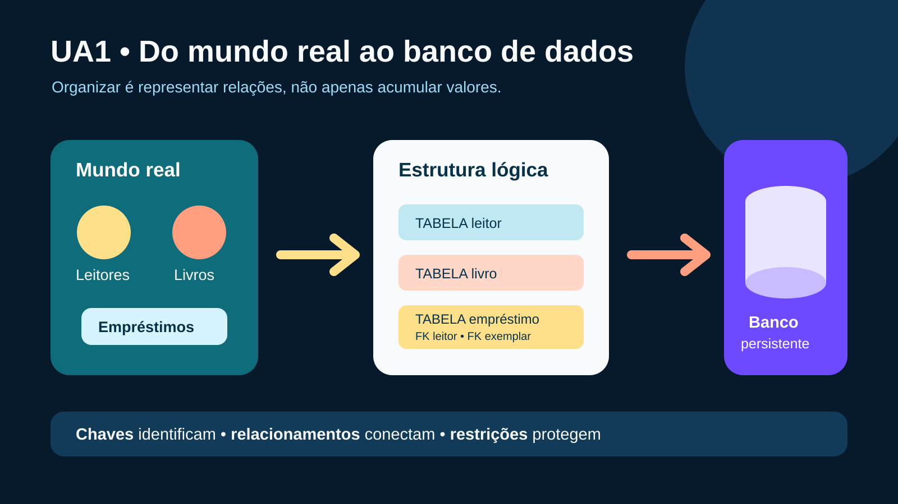

# UA1 — Fundamentos de Banco de Dados

**Disciplina:** Banco de Dados  
**Material autoral:** síntese didática baseada nos objetivos da UA, sem reprodução do material de origem.

## Objetivos de aprendizagem

- Explicar o que é um banco de dados e distingui-lo de uma lista isolada.
- Reconhecer tabelas, linhas, colunas, chaves e relacionamentos.
- Classificar a finalidade de comandos DDL, DML, DQL, DCL e TCL.

## Ideia central

Um banco de dados é uma coleção estruturada de dados relacionados, mantida para representar parte de um contexto real. Em uma biblioteca, pessoas, livros e empréstimos não são listas independentes: o empréstimo liga um leitor a um exemplar em determinada data.

| Conceito | Significado | Exemplo |
|---|---|---|
| Tabela | Conjunto de ocorrências do mesmo tipo | `leitor` |
| Linha ou registro | Uma ocorrência identificável | um leitor cadastrado |
| Coluna ou atributo | Característica registrada | `nome`, `email` |
| Chave primária | Identifica cada linha sem ambiguidade | `id_leitor` |
| Chave estrangeira | Referencia a chave de outra tabela | `emprestimo.id_leitor` |

## Três níveis de abstração

1. **Externo:** cada usuário enxerga apenas o necessário, como a tela de empréstimos.
2. **Conceitual/lógico:** define entidades, atributos, relacionamentos e restrições.
3. **Interno/físico:** trata de arquivos, páginas, índices e formas de armazenamento.

Essa separação reduz a dependência entre a forma de usar os dados e os detalhes físicos de armazenamento.

## Famílias de comandos SQL

| Grupo | Finalidade | Exemplos usuais |
|---|---|---|
| DDL | definir estruturas | `CREATE`, `ALTER`, `DROP` |
| DML | inserir, alterar e remover dados | `INSERT`, `UPDATE`, `DELETE` |
| DQL | consultar dados | `SELECT` |
| DCL | administrar privilégios | `GRANT`, `REVOKE` |
| TCL | controlar transações | `COMMIT`, `ROLLBACK` |

> A classificação de `SELECT` varia entre autores e ferramentas: pode aparecer como DQL ou como parte da DML. O importante é reconhecer que sua finalidade é consultar.

## Exemplo orientado

Em vez de guardar o nome do leitor repetidamente em cada empréstimo, registramos o leitor uma vez e usamos sua chave no empréstimo. Isso evita grafias divergentes e facilita uma alteração cadastral.

## Verificação rápida

Explique por que `emprestimo` precisa referenciar `leitor` e `exemplar`, e não apenas armazenar os nomes digitados livremente.

## Prática vinculada

[Prática 01 — Do problema às tabelas](../02-exercicios-praticos/pratica01-do-problema-as-tabelas.md)

## Referências

- ELMASRI, R.; NAVATHE, S. B. *Sistemas de banco de dados*. 6. ed. São Paulo: Pearson, 2011.
- HEUSER, C. A. *Projeto de banco de dados*. 6. ed. Porto Alegre: Bookman, 2009.
- [PostgreSQL — Tutorial SQL](https://www.postgresql.org/docs/current/tutorial-sql.html)

[Voltar ao índice das UAs](README.md)

