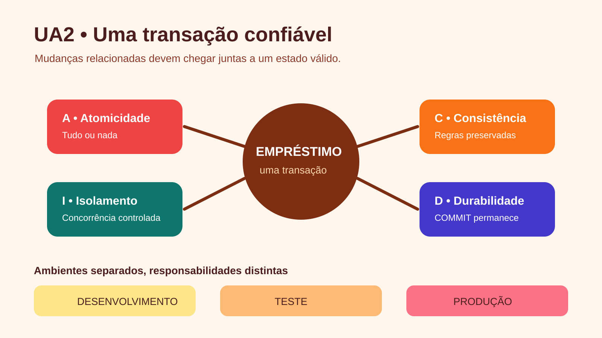

# UA2 — Conceitos de Banco de Dados

**Disciplina:** Banco de Dados  
**Material autoral:** síntese didática baseada nos objetivos da UA, sem reprodução do material de origem.

## Objetivos de aprendizagem

- Justificar o uso de banco de dados em uma organização.
- Distinguir dado, informação, metadado e conhecimento produzido por análise.
- Relacionar integridade, concorrência, segurança, recuperação e propriedades ACID.

## Quando a planilha deixa de bastar?

Planilhas são úteis para cálculos pessoais e conjuntos pequenos. Um SGBD torna-se mais adequado quando várias pessoas precisam registrar dados ao mesmo tempo, há relações entre conjuntos, regras devem ser impostas e alterações precisam ser auditáveis ou recuperáveis.

| Necessidade | Recurso esperado do SGBD |
|---|---|
| Evitar e-mails repetidos | restrição `UNIQUE` |
| Impedir empréstimo sem leitor | chave estrangeira |
| Atender usuários simultâneos | controle de concorrência |
| Recuperar após uma falha | log, transações e backup |
| Limitar o acesso | usuários, papéis e privilégios |

## Dado, informação e metadado

- **Dado:** valor registrado, como `2026-09-07`.
- **Informação:** dado interpretado no contexto, como “data prevista de devolução”.
- **Metadado:** descrição do dado, como nome da coluna, tipo `DATE`, nulidade e regra de validação.

## Transações e ACID

Uma transação reúne operações que formam uma unidade lógica. No registro de uma devolução com multa, não convém salvar a devolução e perder a atualização da multa no meio do processo.

- **Atomicidade:** todas as operações são confirmadas ou todas são desfeitas.
- **Consistência:** as regras válidas antes continuam válidas depois da transação.
- **Isolamento:** transações simultâneas não devem produzir interferências indevidas.
- **Durabilidade:** depois do `COMMIT`, a alteração confirmada deve sobreviver a falhas.

## Ambientes frequentes

Desenvolvimento, teste/homologação e produção têm finalidades diferentes. Dados pessoais reais não devem ser copiados indiscriminadamente para ambientes de aula ou teste; prefira dados sintéticos e permissões mínimas.

## Verificação rápida

Uma bibliotecária e um bibliotecário tentam emprestar o mesmo exemplar no mesmo instante. Quais recursos do SGBD devem impedir dois empréstimos ativos para um único exemplar?

## Prática vinculada

[Prática 02 — Regras, integridade e dicionário de dados](../02-exercicios-praticos/pratica02-regras-integridade-dicionario.md)

## Referências

- DATE, C. J. *Introdução a sistemas de bancos de dados*. 8. ed. Rio de Janeiro: Campus, 2004.
- [MySQL 8.4 — InnoDB e o modelo ACID](https://dev.mysql.com/doc/refman/8.4/en/mysql-acid.html)
- [PostgreSQL — Isolamento de transações](https://www.postgresql.org/docs/current/transaction-iso.html)

[Voltar ao índice das UAs](README.md)

