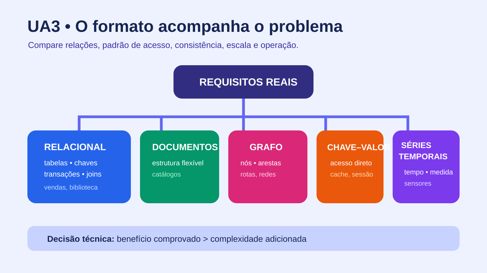

# UA3 — Tipos de Banco de Dados

**Disciplina:** Banco de Dados  
**Material autoral:** síntese didática baseada nos objetivos da UA, sem reprodução do material de origem.

## Objetivos de aprendizagem

- Comparar modelos relacionais e não relacionais.
- Relacionar estrutura, padrão de acesso e requisitos do sistema à escolha tecnológica.
- Distinguir modelo de dados, SGBD e dialeto SQL.

## A escolha começa pelo problema

Não existe um banco universalmente “melhor”. A decisão deve considerar estrutura dos dados, relações, volume, consistência, tipos de consulta, crescimento, equipe, custo e operação.

| Modelo | Organização predominante | Situação em que pode ser útil |
|---|---|---|
| Relacional | tabelas ligadas por chaves | cadastros, vendas, empréstimos e finanças |
| Documentos | documentos semelhantes a JSON | catálogos com atributos variáveis |
| Chave-valor | pares de chave e valor | sessões, cache e preferências simples |
| Grafo | nós e arestas | rotas, recomendações e redes de relações |
| Colunar distribuído | famílias de colunas | grande escala e escrita distribuída |
| Séries temporais | medidas ordenadas no tempo | sensores e monitoramento |

Modelos hierárquico e em rede têm valor histórico e ajudam a compreender a evolução dos sistemas. Hoje, “NoSQL” reúne modelos distintos; não significa ausência total de esquema ou de consultas.

## SGBD não é modelo

O modelo relacional descreve como os dados são representados logicamente. PostgreSQL, MySQL, SQL Server e Oracle Database são produtos que implementam o modelo relacional com recursos e dialetos próprios. MongoDB é um SGBD orientado a documentos.

## Portabilidade SQL

Comandos básicos são semelhantes, mas tipos, funções, paginação, identidade automática e recursos administrativos variam. Evite escolher um produto apenas por uma diferença superficial de sintaxe.

## Estudo de caso

Para empréstimos da biblioteca, o modelo relacional favorece chaves, restrições e transações. Um catálogo complementar com características muito variáveis poderia usar documentos, mas a adoção de duas tecnologias só se justifica se o ganho superar a complexidade operacional.

## Verificação rápida

Indique um requisito que favoreça banco relacional e um que favoreça documentos. Justifique sem citar marcas.

## Prática vinculada

[Prática 03 — Matriz de escolha de SGBD](../02-exercicios-praticos/pratica03-matriz-escolha-sgbd.md)

## Referências

- [PostgreSQL — Documentação atual](https://www.postgresql.org/docs/current/)
- [MySQL 8.4 — Manual de referência](https://dev.mysql.com/doc/refman/8.4/en/)
- [MongoDB — Documentos](https://www.mongodb.com/docs/manual/core/document/)

[Voltar ao índice das UAs](README.md)

