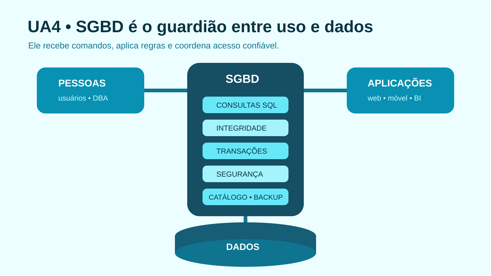

# UA4 — Sistemas de Gerenciamento de Banco de Dados

**Disciplina:** Banco de Dados  
**Material autoral:** síntese didática baseada nos objetivos da UA, sem reprodução do material de origem.

## Objetivos de aprendizagem

- Distinguir banco de dados, SGBD, aplicação e usuário.
- Reconhecer serviços essenciais de um SGBD.
- Elaborar um dicionário de dados coerente com regras de negócio.

## Quatro elementos que não devem ser confundidos

- **Banco de dados:** dados e estruturas persistentes.
- **SGBD:** software que define, consulta, protege e recupera o banco.
- **Aplicação:** sistema que envia comandos ao SGBD conforme um processo de negócio.
- **Usuário/administrador:** pessoas com responsabilidades e privilégios diferentes.

## Serviços esperados

Um SGBD oferece linguagem de definição e consulta, catálogo de metadados, imposição de restrições, controle de transações concorrentes, autenticação e autorização, mecanismos de cópia e recuperação, além de ferramentas de diagnóstico e otimização.

## Dicionário de dados

O dicionário documenta o significado e as regras dos elementos. Ele evita que `status`, por exemplo, tenha interpretações distintas em telas e relatórios.

| Campo | Tipo | Nulo? | Regra | Descrição |
|---|---|---:|---|---|
| `id_leitor` | `INTEGER` | não | chave primária | identificador interno |
| `nome` | `VARCHAR(120)` | não | texto não vazio | nome para atendimento |
| `email` | `VARCHAR(160)` | não | valor único | contato do leitor |
| `ativo` | `BOOLEAN` | não | padrão `TRUE` | permissão cadastral de uso |

O dicionário da equipe é uma documentação humana; o catálogo do SGBD contém metadados técnicos mantidos pelo próprio sistema. Eles se complementam.

## Critérios para escolher um SGBD

Avalie requisitos transacionais, disponibilidade, desempenho, escalabilidade, segurança, conformidade, competências da equipe, ecossistema, suporte, licenciamento, migração e custo total de operação.

## Verificação rápida

Por que “gratuito” ou “mais rápido” não constitui, sozinho, justificativa técnica suficiente para escolher um SGBD?

## Prática vinculada

[Prática 02 — Regras, integridade e dicionário de dados](../02-exercicios-praticos/pratica02-regras-integridade-dicionario.md)

## Referências

- RAMAKRISHNAN, R.; GEHRKE, J. *Sistemas de gerenciamento de banco de dados*. 3. ed. Porto Alegre: AMGH, 2008.
- [Oracle Database — Data Dictionary](https://docs.oracle.com/en/database/oracle/oracle-database/21/cncpt/data-dictionary-and-dynamic-performance-views.html)
- [PostgreSQL — Restrições](https://www.postgresql.org/docs/current/ddl-constraints.html)

[Voltar ao índice das UAs](README.md)

