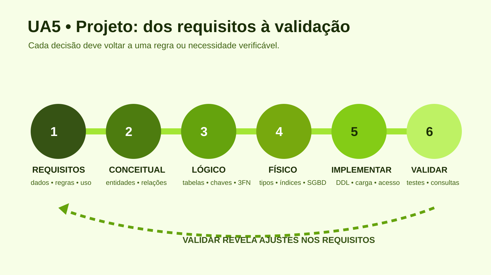

# UA5 — Projeto de Banco de Dados

**Disciplina:** Banco de Dados  
**Material autoral:** síntese didática baseada nos objetivos da UA, sem reprodução do material de origem.

## Objetivos de aprendizagem

- Transformar requisitos em um modelo conceitual entidade-relacionamento.
- Converter entidades e relacionamentos em esquema relacional.
- Aplicar chaves, cardinalidades, restrições e normalização básica.

## Projeto em etapas

1. **Levantamento de requisitos:** identificar dados, operações, regras, volume, segurança e relatórios.
2. **Projeto conceitual:** representar entidades, atributos, relacionamentos e cardinalidades sem depender do SGBD.
3. **Projeto lógico:** converter o modelo para tabelas, chaves e restrições; verificar normalização.
4. **Projeto físico:** definir tipos concretos, índices, particionamento e parâmetros do SGBD.
5. **Implementação e validação:** criar estruturas, carregar dados de teste e conferir casos normais e de erro.

## Modelo ER da biblioteca

- Um `leitor` realiza zero ou muitos `emprestimos`.
- Um `exemplar` participa de zero ou muitos empréstimos ao longo do tempo.
- Cada `emprestimo` refere-se exatamente a um leitor e a um exemplar.
- Um exemplar não pode possuir dois empréstimos ativos simultaneamente.

## Cardinalidade em linguagem simples

| Notação | Leitura |
|---|---|
| 1:1 | uma ocorrência relaciona-se a, no máximo, uma do outro lado |
| 1:N | uma ocorrência pode relacionar-se a muitas |
| N:N | muitas ocorrências de ambos os lados se relacionam; no modelo relacional, costuma exigir tabela associativa |

## Normalização essencial

- **1FN:** valores atômicos e ausência de grupos repetidos.
- **2FN:** todo atributo não chave depende da chave completa.
- **3FN:** atributos não chave não dependem de outros atributos não chave.

Normalizar reduz redundância e anomalias, mas não substitui análise de requisitos. Desnormalização é uma decisão posterior, deliberada e medida.

## Exemplo orientado

Guardar `nome_leitor` em `emprestimo` gera repetição. A solução é manter `id_leitor` como chave estrangeira e obter o nome por junção quando necessário.

## Prática vinculada

[Prática 04 — Projeto integrador da biblioteca](../02-exercicios-praticos/pratica04-projeto-integrador-biblioteca.md)  
[Código base — esquema SQL](../03-codigos/biblioteca-schema.sql)

## Referências

- HEUSER, C. A. *Projeto de banco de dados*. 6. ed. Porto Alegre: Bookman, 2009.
- [MySQL 8.4 — Otimização da estrutura do banco](https://dev.mysql.com/doc/refman/8.4/en/optimizing-database-structure.html)
- [PostgreSQL — CREATE TABLE](https://www.postgresql.org/docs/current/sql-createtable.html)

[Voltar ao índice das UAs](README.md)

