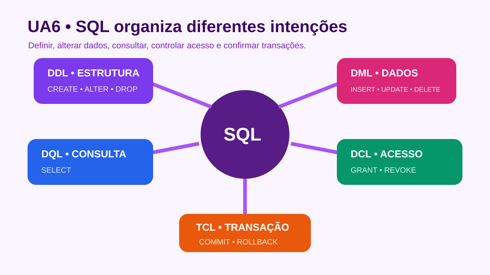

# UA6 — SQL: conceitos e funcionalidades

**Disciplina:** Banco de Dados  
**Material autoral:** síntese didática baseada nos objetivos da UA, sem reprodução do material de origem.



## Objetivos de aprendizagem

- Reconhecer a natureza declarativa da SQL.
- Usar operadores relacionais, lógicos e aritméticos com segurança.
- Relacionar comandos de definição, manipulação, consulta, controle e transação.

## SQL é declarativa

Em uma consulta, descrevemos o resultado desejado; o otimizador do SGBD decide um plano de execução. Por isso, duas consultas equivalentes podem receber planos distintos conforme índices e estatísticas.

```sql
SELECT titulo, ano_publicacao
FROM livro
WHERE ano_publicacao >= 2020
ORDER BY titulo;
```

## Operadores importantes

| Categoria | Exemplos | Cuidado principal |
|---|---|---|
| Relacionais | `=`, `<>`, `<`, `>`, `<=`, `>=` | comparar tipos compatíveis |
| Lógicos | `AND`, `OR`, `NOT` | usar parênteses quando houver combinação |
| Faixa/conjunto | `BETWEEN`, `IN` | conferir inclusão dos limites |
| Padrão | `LIKE` | `%` representa qualquer sequência |
| Nulidade | `IS NULL`, `IS NOT NULL` | nunca testar nulo com `= NULL` |
| Aritméticos | `+`, `-`, `*`, `/` | considerar tipo e divisão por zero |

## O valor NULL

`NULL` representa ausência ou desconhecimento, não zero nem texto vazio. Expressões com `NULL` podem resultar em valor lógico desconhecido. Use `IS NULL` e trate agregações com atenção.

## Transação segura

```sql
START TRANSACTION;

UPDATE exemplar
SET disponivel = FALSE
WHERE id_exemplar = 3 AND disponivel = TRUE;

INSERT INTO emprestimo (id_leitor, id_exemplar, data_emprestimo, data_prevista)
VALUES (2, 3, CURRENT_DATE, CURRENT_DATE + 7);

COMMIT;
```

Em aplicação real, é preciso verificar se o `UPDATE` afetou exatamente uma linha; caso contrário, realizar `ROLLBACK`.

## Verificação rápida

Reescreva a condição “livros publicados de 2018 a 2025, exceto os de categoria Referência” usando parênteses e operadores adequados.

## Prática vinculada

[Código base — esquema e dados](../03-codigos/biblioteca-schema.sql)  
[Laboratório de comandos e consultas](../03-codigos/biblioteca-consultas.sql)

## Referências

- [PostgreSQL — Sintaxe de expressões](https://www.postgresql.org/docs/current/sql-expressions.html)
- [PostgreSQL — INSERT](https://www.postgresql.org/docs/current/sql-insert.html)
- [Oracle Database — Conceitos de transação](https://docs.oracle.com/en/database/oracle/oracle-database/21/lnpcb/database-concepts.html)

[Voltar ao índice das UAs](README.md)

