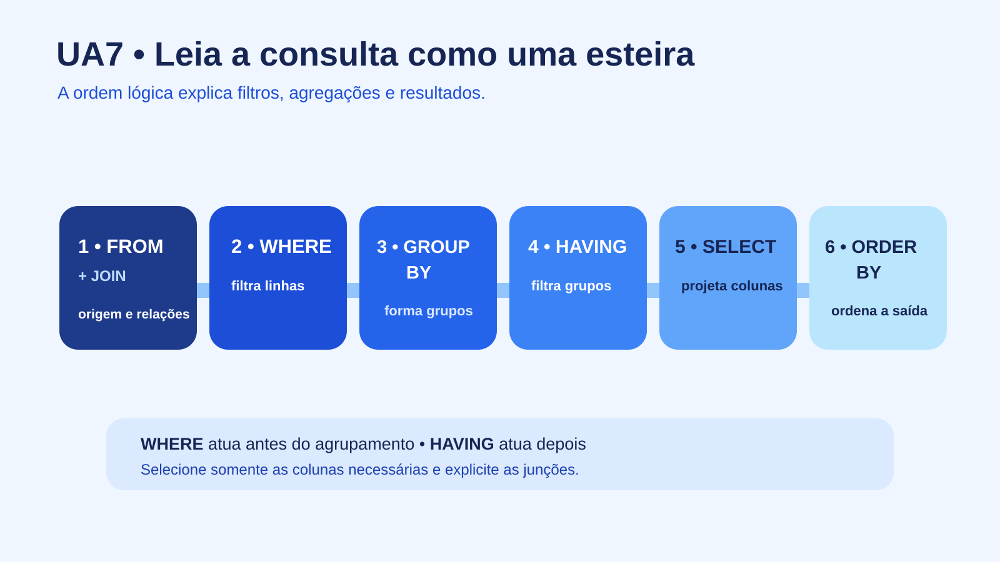

# UA7 — Linguagem de Consulta de Dados (DQL)

**Disciplina:** Banco de Dados  
**Material autoral:** síntese didática baseada nos objetivos da UA, sem reprodução do material de origem.



## Objetivos de aprendizagem

- Construir consultas com `SELECT`, filtros, ordenação e agregação.
- Combinar tabelas por meio de junções explícitas.
- Diferenciar ordem escrita e ordem lógica de processamento.

## Anatomia do SELECT

```sql
SELECT l.nome, COUNT(*) AS total_emprestimos
FROM leitor AS l
JOIN emprestimo AS e ON e.id_leitor = l.id_leitor
WHERE e.data_emprestimo >= DATE '2026-01-01'
GROUP BY l.id_leitor, l.nome
HAVING COUNT(*) >= 2
ORDER BY total_emprestimos DESC, l.nome;
```

| Cláusula | Papel |
|---|---|
| `SELECT` | escolhe expressões e colunas do resultado |
| `FROM` / `JOIN` | define fontes e como elas se relacionam |
| `WHERE` | filtra linhas antes do agrupamento |
| `GROUP BY` | reúne linhas para cálculo agregado |
| `HAVING` | filtra grupos formados |
| `ORDER BY` | ordena o resultado final |

## Ordem lógica simplificada

Embora `SELECT` apareça primeiro na escrita, uma leitura lógica útil é: `FROM/JOIN` → `WHERE` → `GROUP BY` → `HAVING` → `SELECT` → `ORDER BY`. Essa ordem ajuda a entender por que um apelido criado em `SELECT` nem sempre pode ser usado em `WHERE`.

## Junções

- `INNER JOIN`: retorna apenas correspondências.
- `LEFT JOIN`: mantém todas as linhas da tabela à esquerda, mesmo sem correspondência.
- O predicado `ON` deve expressar a relação entre chaves; omiti-lo pode produzir produto cartesiano acidental.

## Agregação

`COUNT`, `SUM`, `AVG`, `MIN` e `MAX` resumem grupos. `COUNT(*)` conta linhas; `COUNT(coluna)` ignora valores nulos daquela coluna.

## Consulta responsável

Evite `SELECT *` em relatórios e aplicações duradouras: declare as colunas necessárias. Use filtros coerentes, nomes legíveis e examine o plano com `EXPLAIN` quando houver problema de desempenho.

## Desafio

Liste todos os leitores, inclusive os que nunca fizeram empréstimo, com a quantidade de empréstimos de cada um. Explique por que `LEFT JOIN` é necessário.

## Prática vinculada

[Laboratório de comandos e consultas](../03-codigos/biblioteca-consultas.sql)  
[Prática 04 — Projeto integrador da biblioteca](../02-exercicios-praticos/pratica04-projeto-integrador-biblioteca.md)

## Referências

- [PostgreSQL — SELECT](https://www.postgresql.org/docs/current/sql-select.html)
- [PostgreSQL — Tutorial de junções](https://www.postgresql.org/docs/current/tutorial-join.html)
- [PostgreSQL — EXPLAIN](https://www.postgresql.org/docs/current/using-explain.html)

[Voltar ao índice das UAs](README.md)
