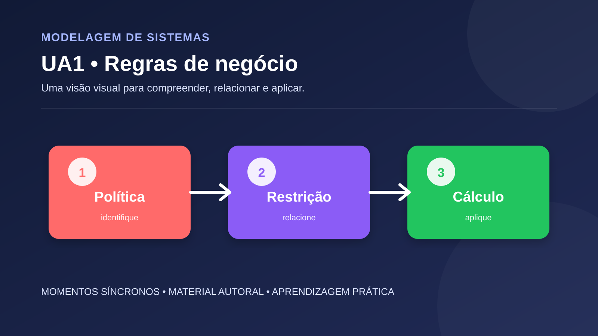

# UA1 — Identificar e documentar regras de negócio

**Disciplina:** Modelagem de Sistemas  
**Material autoral:** síntese didática, não reprodução de material de outra plataforma.

## Objetivo

Distinguir regra de negócio, requisito e decisão de implementação.

## Síntese conceitual

Uma regra expressa uma política, restrição ou cálculo do domínio. Ela deve ser escrita de forma verificável, possuir fonte ou responsável e permanecer independente da tecnologia sempre que possível.

## Aplicação prática

Para uma loja escolar, escreva dez regras sobre cadastro, estoque, descontos, pagamento e devolução. Classifique cada uma como estrutural, operacional ou derivada.

## Verificação de consistência

- A linguagem usada é a do domínio?
- Cada elemento possui responsabilidade clara?
- As regras podem ser verificadas?
- Os diagramas mantêm nomes e relações coerentes entre si?

## Referência técnica

- [Especificação UML 2.5.1 — OMG](https://www.omg.org/spec/UML/2.5.1/About-UML)

[Voltar ao índice da disciplina](../README.md)
