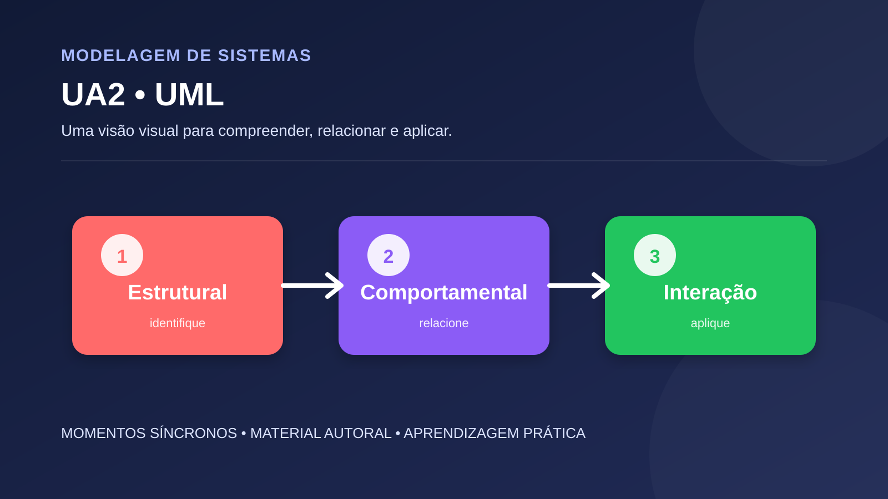

# UA2 — Linguagem de Modelagem Unificada (UML)

**Disciplina:** Modelagem de Sistemas  
**Material autoral:** síntese didática, não reprodução de material de outra plataforma.

## Objetivo

Compreender a finalidade da UML e selecionar diagramas adequados ao problema.

## Síntese conceitual

UML é uma linguagem de modelagem; não é metodologia de desenvolvimento. Diagramas estruturais mostram elementos relativamente estáveis, enquanto diagramas comportamentais representam ações, interações e mudanças.

## Aplicação prática

Dado um sistema de biblioteca, escolha três diagramas para explicar estrutura, fluxo e interação. Justifique a escolha e delimite o que não será modelado.

## Verificação de consistência

- A linguagem usada é a do domínio?
- Cada elemento possui responsabilidade clara?
- As regras podem ser verificadas?
- Os diagramas mantêm nomes e relações coerentes entre si?

## Referência técnica

- [Especificação UML 2.5.1 — OMG](https://www.omg.org/spec/UML/2.5.1/About-UML)

[Voltar ao índice da disciplina](../README.md)
