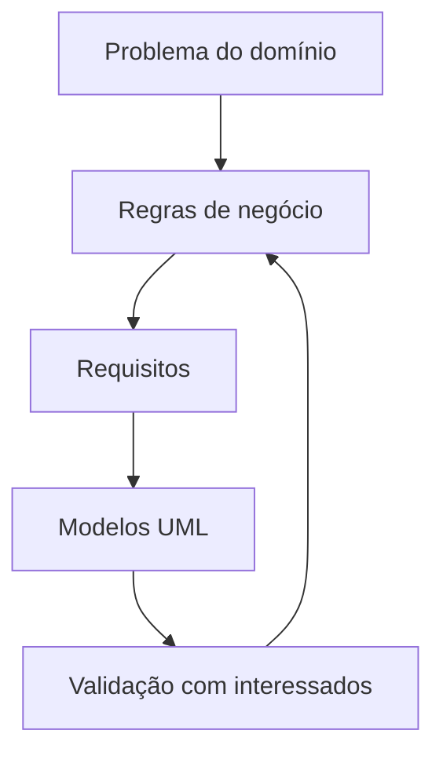
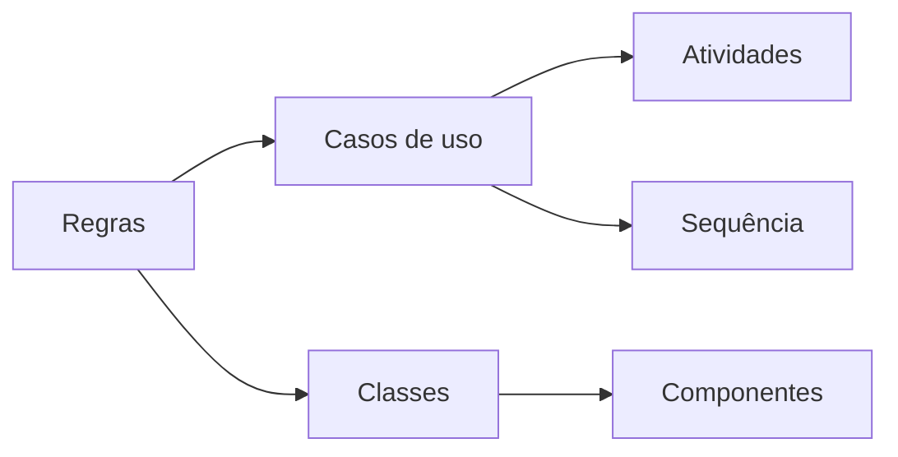

# Diagramas originais — Modelagem de Sistemas

## Do domínio ao modelo

```mermaid
flowchart TD
 A[Problema do domínio] --> B[Regras de negócio]
 B --> C[Requisitos]
 C --> D[Modelos UML]
 D --> E[Validação com interessados]
 E --> B
```

## Relação entre diagramas

```mermaid
flowchart LR
 U[Casos de uso] --> A[Atividades]
 U --> S[Sequência]
 R[Regras] --> U
 R --> C[Classes]
 C --> K[Componentes]
```
