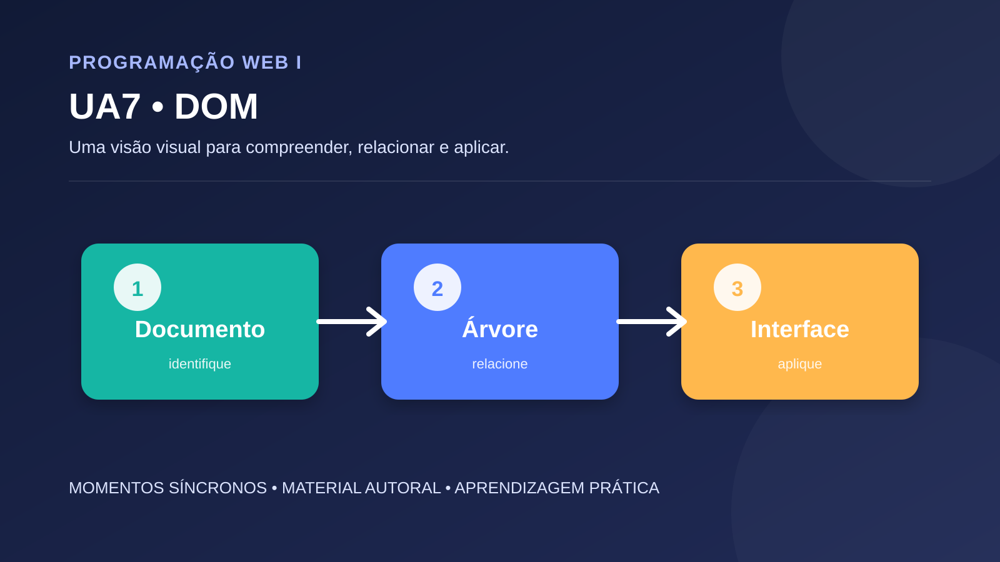

# UA7 — DOM — Document Object Model

**Disciplina:** Programação Web I  
**Material autoral:** síntese didática, não reprodução de material de outra plataforma.

## Objetivo

Selecionar nós, modificar conteúdo e atributos e responder a eventos com segurança.

## Síntese conceitual

O DOM representa o documento como uma árvore de nós. querySelector, textContent, classList e addEventListener permitem atualizar a interface mantendo a estrutura separada da lógica.

## Aplicação prática

Crie uma lista de tarefas. Um formulário adiciona itens, um botão marca a tarefa concluída e outro remove o item. Use textContent para conteúdo fornecido pelo usuário.

## Roteiro de verificação

- A solução apresenta separação entre estrutura, apresentação e comportamento?
- Os nomes dos elementos e variáveis comunicam sua finalidade?
- O resultado foi testado em mais de uma situação?
- Foram consideradas acessibilidade, validação e manutenção?

## Referências técnicas

- [Fonte 1](https://dom.spec.whatwg.org/)
- [Fonte 2](https://developer.mozilla.org/pt-BR/docs/Web/API/Document_Object_Model)

[Voltar ao índice da disciplina](../README.md)
