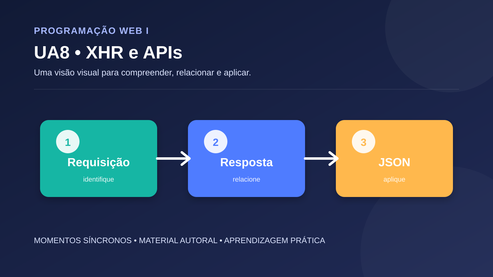

# UA8 — JavaScript, XMLHttpRequest e APIs Web

**Disciplina:** Programação Web I  
**Material autoral:** síntese didática, não reprodução de material de outra plataforma.

## Objetivo

Compreender requisições assíncronas, estados de resposta, JSON e tratamento de erros.

## Síntese conceitual

XMLHttpRequest permite trocar dados com um servidor sem recarregar a página. Em projetos novos, Fetch costuma ser mais simples, mas XHR permanece importante para compreender o modelo assíncrono e sistemas legados.

## Aplicação prática

Consuma uma API pública de dados em JSON, mostre carregamento, sucesso e erro em estados visíveis e registre o método HTTP, URL e formato da resposta.

## Roteiro de verificação

- A solução apresenta separação entre estrutura, apresentação e comportamento?
- Os nomes dos elementos e variáveis comunicam sua finalidade?
- O resultado foi testado em mais de uma situação?
- Foram consideradas acessibilidade, validação e manutenção?

## Referências técnicas

- [Fonte 1](https://developer.mozilla.org/en-US/docs/Web/API/XMLHttpRequest)
- [Fonte 2](https://developer.mozilla.org/pt-BR/docs/Web/API/Fetch_API)

[Voltar ao índice da disciplina](../README.md)
