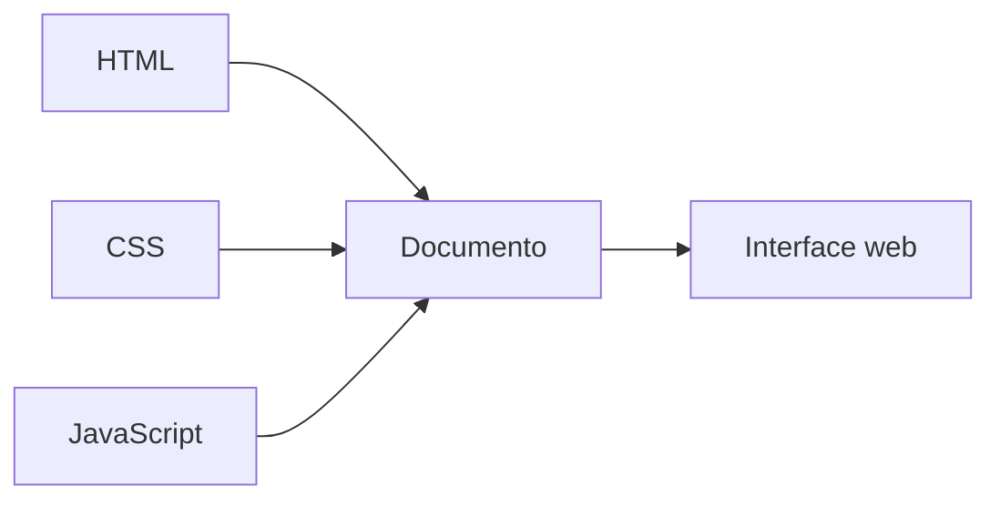
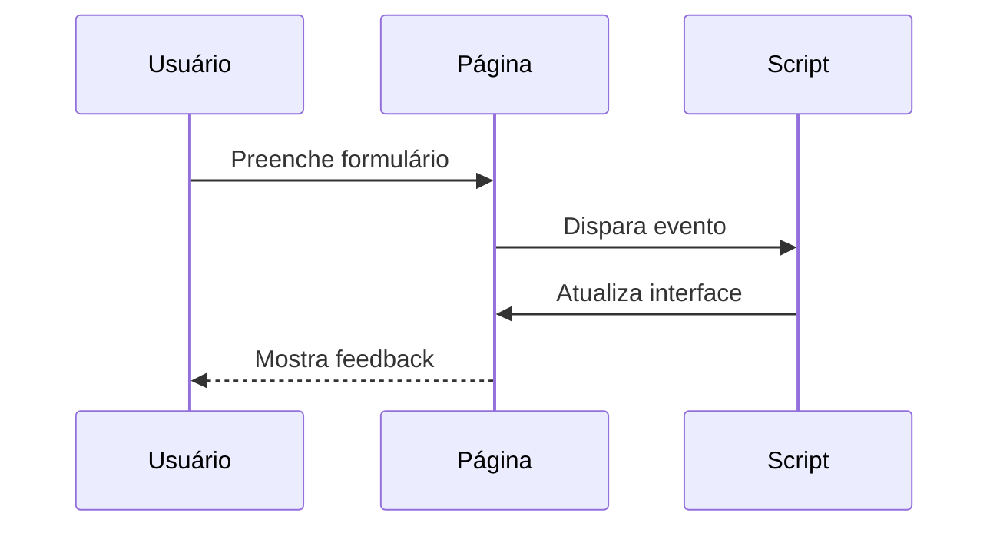

# Diagramas originais — Programação Web I

Os diagramas abaixo foram produzidos para este repositório e não são imagens extraídas de materiais externos.

## Separação de responsabilidades

## Fluxo de interação

